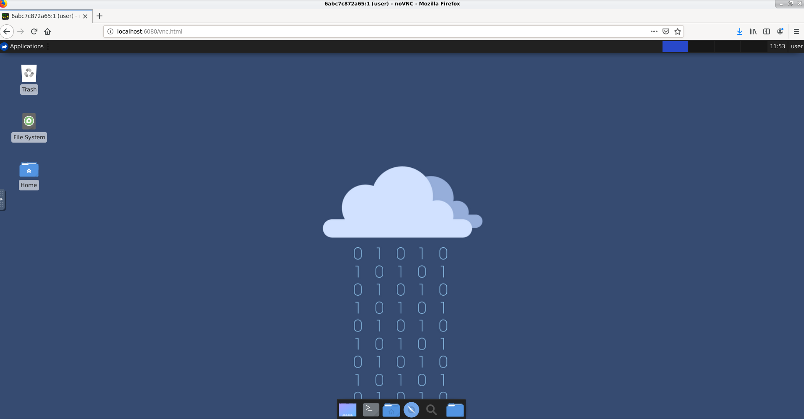

# CDI - Containerised Desktop Infrastructure
This container contains a desktop, which can be accessed through your web browser.

### How to run
```bash
$ docker run -p 6080:6080 rutgerhartog/cdi
```

Then open your web browser at http://localhost:6080/vnc.html and you should see something like this:


### How it works
It is based on Debian with XFCE4, running Tiger VNC server and noVNC.

### Why a container instead of a VM?
I created this repo because I wanted to have a lightweight container, which can easily be disposed of after use and have as little dependencies for the client as possible.

### Kubernetes
The container contains two scripts which can be used as readiness and liveness probes within Kubernetes. A basic deployment for Kubernetes would be:

```yaml
apiVersion: v1
kind: Service
metadata:
  name: cdi
  labels:
    app: cdi
spec:
  ports:
    - port: 6080
  selector:
    app: cdi
---
apiVersion: apps/v1
kind: Deployment
metadata:
  name: cdi
  labels:
    app: cdi
spec:
  replicas: 5
  selector:
    matchLabels:
      app: cdi
  template:
    metadata:
      labels:
        app: cdi
    spec:
      containers:
      - name: cdi
        image: rutgerhartog/cdi
        ports:
        - containerPort: 6080
        readinessProbe:
          exec:
            command:
              - readinessprobe
          periodSeconds: 5
        livenessProbe:
          exec:
            command:
              - livenessprobe
          periodSeconds: 5
        resources:
          requests:
            memory: "1000Mi"
            cpu: "250m"
          limits:
            memory: "4000Mi"
            cpu: "1000m"

```
Whenever you connect to one of the containers, the readiness probe fails and other users cannot access the container currently used. Whenever you log out or close the tab, the liveness probe will fail, which tells Kubernetes to restart the container.

In production environments, I recommend using some kind of persistence to avoid data loss. Furthermore, for security reasons, I also recommend using a reverse proxy to enforce TLS and make sure users are authenticated before accessing this container.
